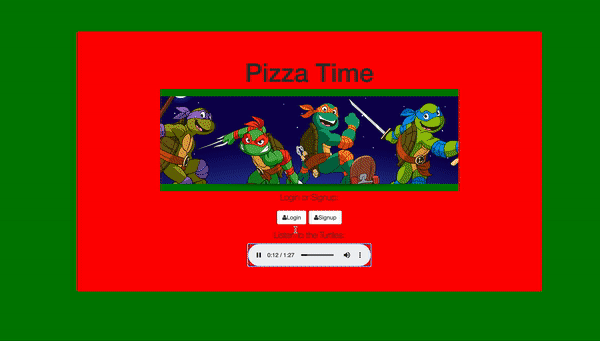

# Pizza Time!
Cowabunga dudes! It's Pizza time! Signup in order to make a delicious order! There's cheese, pepporoni and vegan options!

**Link to project:** https://pizzahh-time.herokuapp.com/

## How It's Made:

**Tech used:** HTML, CSS, JavaScript, Node.js, Express, MongoDB

Brought to you by JavaScript, Pizza Time requires a user signup in order to make an order. Orders are saved on MonogoDB, identifiable by either username or the respective's user's generated ID number.

<!-- ## Optimizations
*(optional)*

You don't have to include this section but interviewers *love* that you can not only deliver a final product that looks great but also functions efficiently. Did you write something then refactor it later and the result was 5x faster than the original implementation? Did you cache your assets? Things that you write in this section are **GREAT** to bring up in interviews and you can use this section as reference when studying for technical interviews! -->

## Lessons Learned:

Heroes in a half-shell, turtle power!

<!-- ## Examples:
Take a look at these couple examples that I have in my own portfolio:

**Palettable:** https://github.com/alecortega/palettable

**Twitter Battle:** https://github.com/alecortega/twitter-battle

**Patch Panel:** https://github.com/alecortega/patch-panel

 -->
